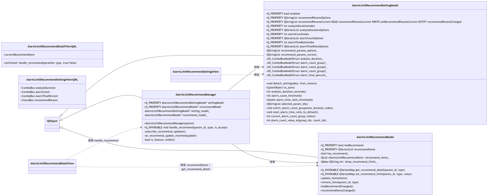
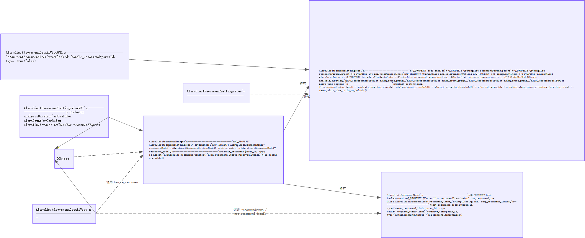
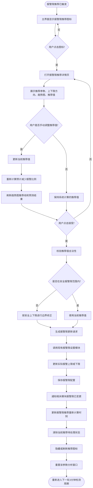
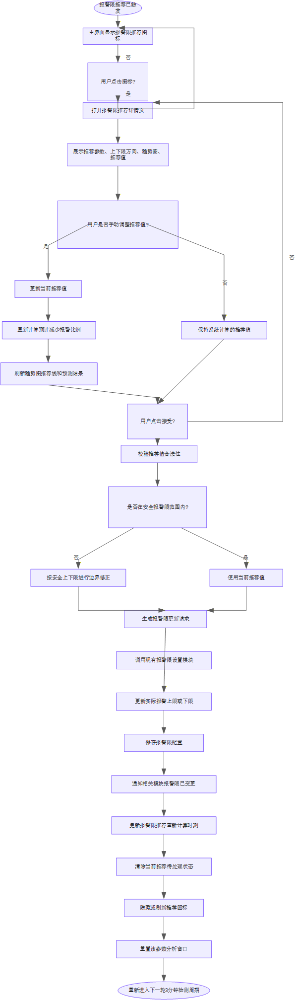
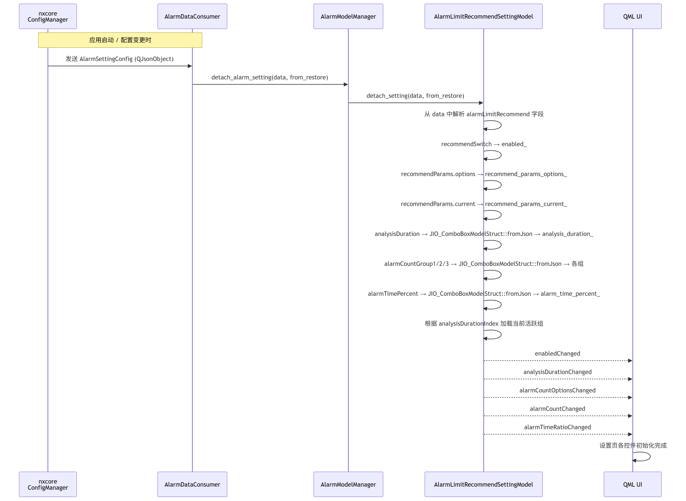
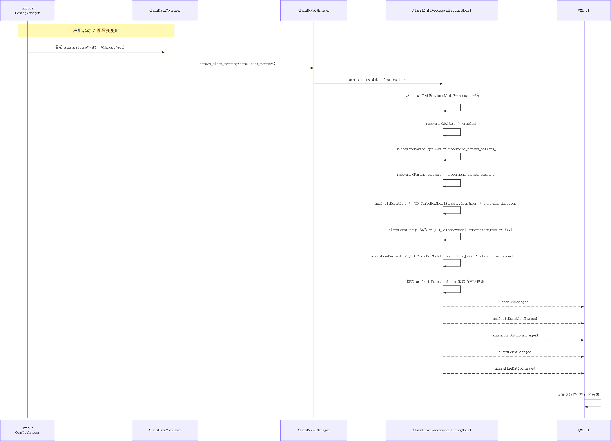

# EdanImageToVisio

EdanImageToVisio 是一个 Agent Skill，用于把参考图片、截图、Mermaid 导出图、流程图、时序图、架构图等复刻成可编辑的 Microsoft Visio `.vsdx` 文件。

它适用于支持 `SKILL.md` 的 Codex / Claude Code 等 Skill 加载器。

## 工作方式

这个 Skill 不是传统意义上的“图片自动矢量化转换器”。它采用更可控的工作流：

1. 识别参考图中的结构、文字、容器、箭头和层级关系。
2. 生成一份 JSON 图形计划。
3. 通过 PowerShell 调用 Visio COM 自动化。
4. 在 Visio 中绘制可编辑的矩形、文字框、线条、箭头和椭圆等对象。
5. 保存为 `.vsdx`，并可选导出 `.emf` 预览。
6. 可选把原始参考图嵌入到第二页，方便对照。

## 适合场景

- 把截图里的流程图复刻成可编辑 Visio。
- 把 Mermaid 导出的 PNG 复刻成 Visio。
- 把架构图、泳道图、时序图、模块图整理成 `.vsdx`。
- 先生成 JSON plan，再由 Visio 脚本稳定绘制。
- 为后续人工精修提供一个可编辑初稿。

## 示例效果

下面三张 Mermaid 导出图可以作为典型转换样例。转换后不是把 PNG 整张贴进 Visio，而是由模型先生成 JSON 图形计划，再由脚本绘制成可编辑的 Visio 对象。

### 类图

类图会优先保留类框、属性区、方法区、继承/持有/绑定关系和连线方向。转换成 `.vsdx` 后，类名、成员文本、分区线和关系箭头都可以继续编辑，适合后续在 Visio 中调整布局、补充字段或整理依赖关系。

原图：



生成结果预览：



### 流程图

流程图会优先保留开始/结束节点、处理节点、判断节点、分支标签和回环路径。转换成 `.vsdx` 后，每个节点和箭头都是独立对象，适合继续修改节点文字、调整分支走向或把长流程拆成多页。当前脚本暂不支持原生菱形节点，示例结果中使用可编辑矩形近似表达判断节点。

原图：



生成结果预览：



### 时序图

时序图会优先保留参与者、生命线、同步/异步消息、虚线通知和自调用步骤。转换成 `.vsdx` 后，参与者框、竖向生命线、消息箭头和说明文本都可以单独编辑，适合把 Mermaid 生成的时序图整理成正式交付文档。

原图：



生成结果预览：



## 环境要求

- Windows
- Microsoft Visio
- PowerShell
- Visio COM 自动化可用

可以先运行环境检查：

```powershell
powershell -NoProfile -ExecutionPolicy Bypass -File .\scripts\check_visio_environment.ps1 -TryCom
```

## 安装到 Codex

把 `edan-image-to-visio` 文件夹复制到 Codex 的 skills 目录：

```powershell
$skills = "$env:USERPROFILE\.codex\skills"
New-Item -ItemType Directory -Force -Path $skills | Out-Null
Copy-Item -Recurse -Force ".\edan-image-to-visio" $skills
```

然后重启 Codex 或 reload skills。

## 安装到 Claude Code

把同一个 `edan-image-to-visio` 文件夹复制到 Claude Code 的用户级 skills 目录：

```powershell
$skills = "$env:USERPROFILE\.claude\skills"
New-Item -ItemType Directory -Force -Path $skills | Out-Null
Copy-Item -Recurse -Force ".\edan-image-to-visio" $skills
```

然后重启 Claude Code 或刷新 skills。

## 使用示例

```text
Use $edan-image-to-visio to recreate this reference diagram as an editable Visio file, export a preview, and explain any approximations.
```

也可以中文请求：

```text
使用 $edan-image-to-visio，把这张图片复刻成可编辑的 Visio 文件，并导出预览。
```

## 产物

通常会生成：

- `.vsdx`：可编辑 Visio 文件。
- `.json`：图形计划，可复用和调整。
- `.emf`：第一页预览图，可用于快速检查。

## 注意事项

- 该 Skill 不会自动 OCR 或自动矢量化整张图片。
- 可编辑效果依赖模型先生成 JSON 图形计划。
- 当前脚本支持 `rect`、`text`、`oval`、`line`、`polyline`。
- 圆角矩形、渐变、复杂图标、精准字体和 Mermaid 原生布局可能需要人工微调。
- Visio COM 对相对路径和含非 ASCII 字符的图片路径比较敏感，建议使用绝对路径，并把参考图复制到英文路径下再导入。
